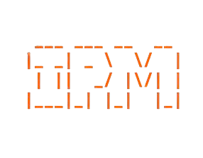
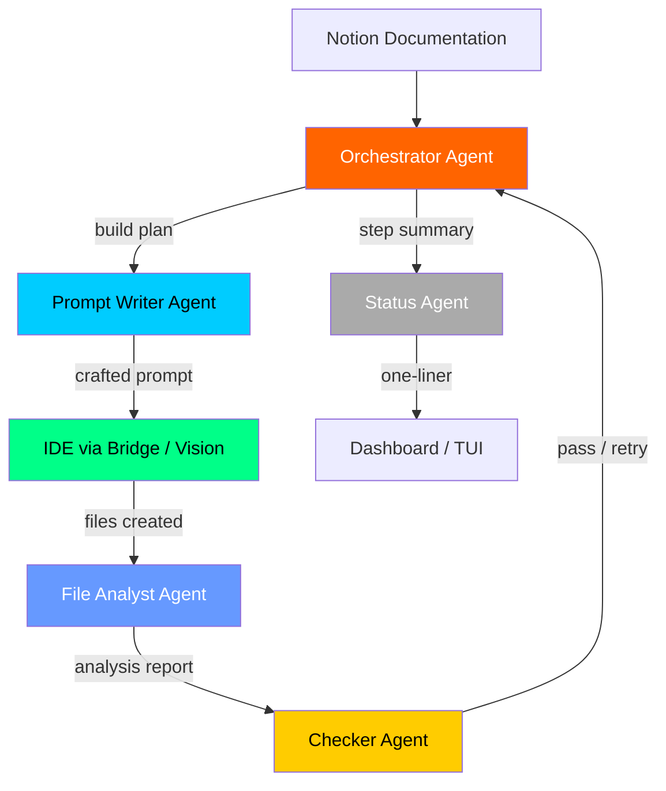
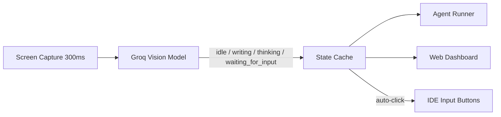
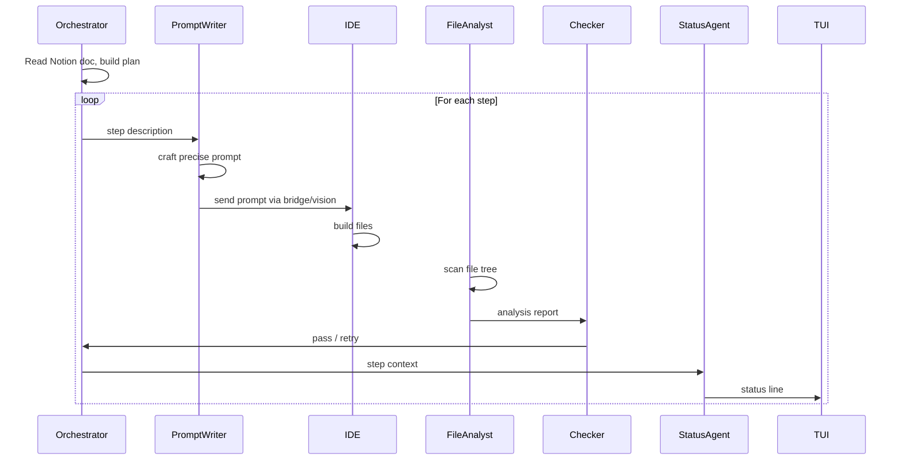
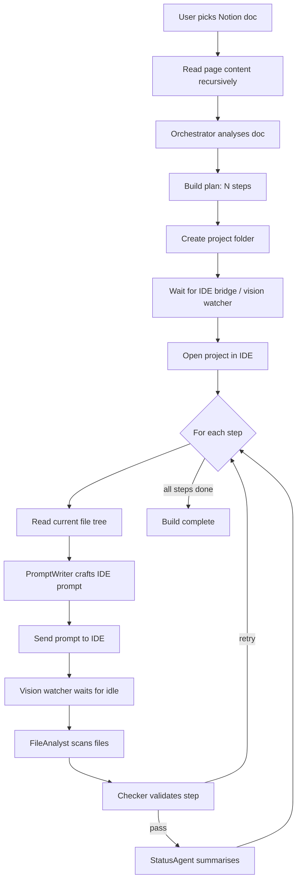

<p align="center">
  
</p>

> **Intelligent Project Manager** — An autonomous multi-agent IDE automation system powered by Groq.

IPM reads your project documentation from Notion, thinks about it using a team of specialized AI agents, and autonomously builds the project inside your IDE — while you watch it happen in real time from a web dashboard or terminal UI.

---

## What is IPM?

IPM is not a chatbot. It is an **autonomous build agent** that:

1. Reads your Notion project documentation
2. Spins up a team of 5 specialized AI agents
3. Each agent has a specific role and the best model for that role
4. Agents communicate with each other in real time
5. IPM sends precise prompts to your IDE (Kiro or Cursor) step by step
6. A live vision watcher monitors the IDE screen in real time — it knows when the IDE is writing, thinking, or waiting for input
7. The IDE builds the project while IPM watches, validates, and corrects

You open IPM, pick a Notion doc, and watch your project get built.

---

## Two Ways to Run

### Web Dashboard — `npm run dev`

A full browser-based dashboard with:
- Live screen preview of the IDE (updated every ~350ms)
- Chat-style agent activity log
- Kiro / Cursor IDE selector
- Light and dark theme toggle
- Notion doc picker with logo
- Real-time IDE state badge (Idle / Writing / Thinking / Input Needed)

### Terminal UI — `IPM`

A compact Ink-based TUI in your terminal with:
- Notion token setup and doc picker
- Live inter-agent message feed
- IDE state and step progress

Both modes run the same underlying agent pipeline. You can use either or both simultaneously.

---

## Architecture

### Multi-Agent System



### Agent Roles & Models

| Agent | Model | Role |
|---|---|---|
| Orchestrator | `moonshotai/kimi-k2-instruct` | Reads docs, creates build plan, coordinates all agents |
| Prompt Writer | `moonshotai/kimi-k2-instruct` | Converts steps into precise IDE prompts |
| File Analyst | `moonshotai/kimi-k2-instruct` | Reads file tree, assesses what was built |
| Checker | `groq/compound` | Validates each step, decides pass or retry |
| Status Agent | `llama-3.1-8b-instant` | Produces fast human-readable status lines |

> Models are fetched **live** from the Groq API on every run. The best available model is auto-assigned to each role.

---

## Vision Watcher

IPM includes a persistent background vision process (`src/vision/watcher.js`) that acts as the eyes of the system.

- Captures the screen every **300ms** using `screencapture`
- Sends frames to the **Groq vision model** over a keep-alive HTTPS connection
- Classifies IDE state in real time: `idle` · `writing` · `thinking` · `waiting_for_input`
- Caches input bar coordinates and handles Retina display scaling automatically
- **Autonomously handles `waiting_for_input`** — clicks buttons and submits answers without waiting for a command
- IPM only injects the next prompt when the IDE has been stably `idle` for 1500ms
- Listens on `~/.ipm/vision.sock` for `send_prompt` and `get_state` commands

The vision watcher starts automatically when IPM starts — no manual setup needed.



---

## IDE Support

IPM supports two IDEs, selectable from the web dashboard sidebar:

| IDE | Method | Notes |
|---|---|---|
| **Kiro** | VS Code extension bridge + vision watcher | Default |
| **Cursor** | Direct API injection via Cursor API | Uses `crsr_` API key |

The IDE bridge extension auto-installs to `~/.kiro/extensions/ipm.ide-bridge-1.0.0/` on first run.

---

## Web Dashboard

Start with:

```bash
npm run dev
```

Opens automatically in your browser at `http://localhost:3000`.

### Features

- **Live Preview** — real-time screen capture of the IDE, updated every 350ms
- **Agent Activity Log** — chat-style feed of every agent action, color-coded by type
- **IDE Selector** — switch between Kiro and Cursor with logo buttons
- **Notion Doc Picker** — browse and select your Notion pages
- **State Badge** — live IDE state indicator (Idle / Writing / Thinking / Input Needed)
- **Light / Dark Theme** — toggle with sun/moon button in sidebar, persisted to localStorage
- **Elapsed Timer** — tracks how long the current build has been running

---

## Inter-Agent Communication

All agents share a **MessageBus**. Every message is visible in the dashboard and TUI in real time.



---

## Installation

### Prerequisites

- Node.js 18+
- A [Groq API key](https://console.groq.com/) (free tier works)
- A [Notion Integration Token](https://www.notion.so/my-integrations)
- [Kiro](https://kiro.dev/) or [Cursor](https://cursor.sh/) installed

### Install

```bash
git clone https://github.com/Shubham-Ramkabir/IPM.git
cd IPM
npm install --legacy-peer-deps
npm install -g . --legacy-peer-deps --prefix ~/.npm-global
```

Add to your shell profile if needed:

```bash
export PATH="$HOME/.npm-global/bin:$PATH"
```

### Configure

```bash
cp .env.example .env
```

```env
GROQ_API_KEY=your_groq_api_key_here
```

---

## Running IPM

```bash
# Web dashboard (opens browser automatically)
npm run dev

# Terminal UI
IPM
```

Both start the vision watcher daemon automatically in the background.

---

## File Structure

```
IPM/
├── bin/
│   └── ipm.js                  # CLI entry point
├── src/
│   ├── tui/
│   │   └── index.js            # Ink TUI — all screens and agent comms panel
│   ├── agent/
│   │   ├── agents.js           # 5 agents + MessageBus + live model fetching
│   │   ├── runner.js           # Build pipeline — supports kiro + cursor
│   │   ├── ide.js              # IDE bridge client + vision watcher routing
│   │   ├── cursor.js           # Cursor API integration
│   │   ├── daemons.js          # Vision watcher auto-spawn
│   │   └── notion.js           # Notion API client
│   ├── vision/
│   │   └── watcher.js          # Persistent vision process (Groq vision model)
│   ├── web/
│   │   ├── server.js           # Express server — SSE, /frame, /run, /docs
│   │   └── public/
│   │       ├── index.html      # Single-page dashboard
│   │       ├── app.js          # Dashboard JS — SSE, frame poller, theme
│   │       └── style.css       # Orange + white design, dark/light themes
│   └── db/
│       └── index.js            # SQLite config + run history
├── ide-extension/
│   ├── extension.js            # VS Code extension — Unix socket server
│   └── package.json
├── .env.example
├── package.json
└── Readme.md
```

---

## How the Build Pipeline Works



---

## Data & Privacy

- Notion token stored locally in `~/.ipm/ipm.db` (SQLite)
- Groq API key stays in `.env` — never committed
- Run history stored locally in `~/.ipm/ipm.db`
- Nothing sent anywhere except Groq API (LLM calls) and Notion API (doc reading)

---

## Tech Stack

| Layer | Technology |
|---|---|
| Web Dashboard | Express + SSE + vanilla JS |
| Terminal UI | [Ink](https://github.com/vadimdemedes/ink) (React for CLIs) |
| LLM Provider | [Groq](https://groq.com/) — ultra-fast inference |
| Vision | Groq vision model — live screen classification |
| Models | Kimi K2, Groq Compound, Llama 3.1 |
| Notion | [@notionhq/client](https://github.com/makenotion/notion-sdk-js) |
| Database | [better-sqlite3](https://github.com/WiseLibs/better-sqlite3) |
| IDE Bridge | VS Code Extension API (Unix socket) |
| Cursor | Cursor API direct injection |

---

## License

MIT

---

## Built By

**Shubham Ramkabir** — AI-First Developer @ E2M

Powered by [Groq](https://groq.com/) · [Kiro](https://kiro.dev/) · [Notion](https://notion.so/) · [Cursor](https://cursor.sh/)
