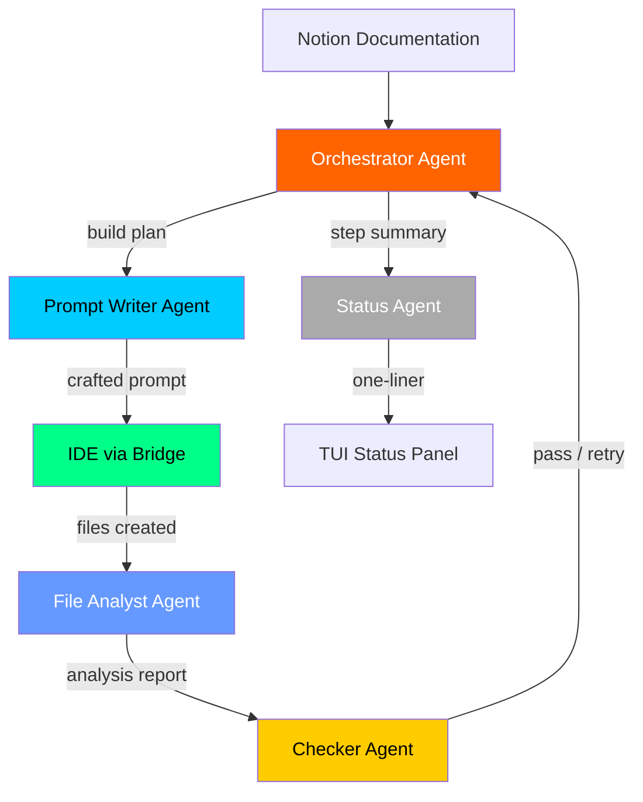
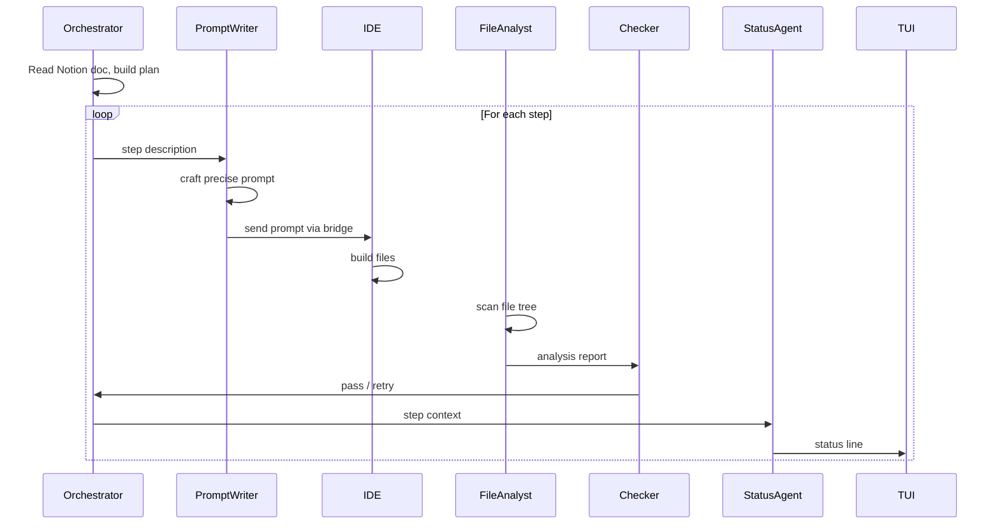
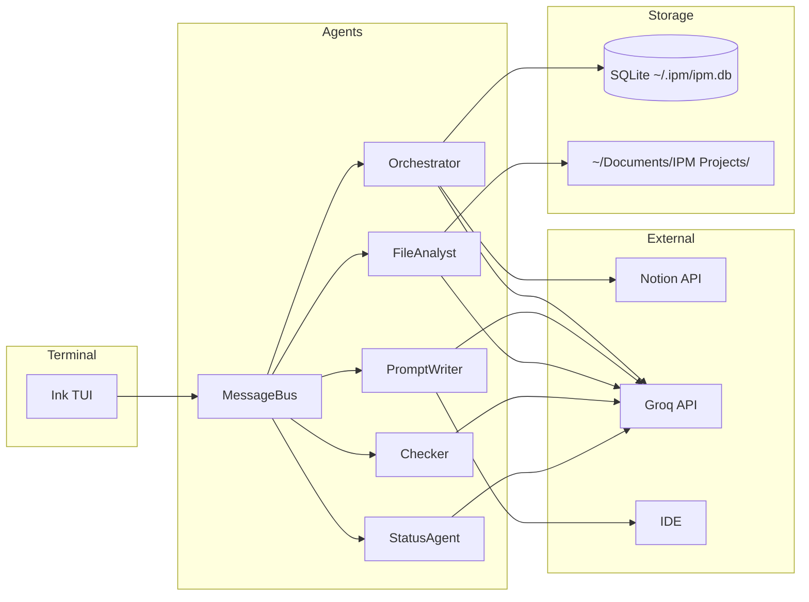
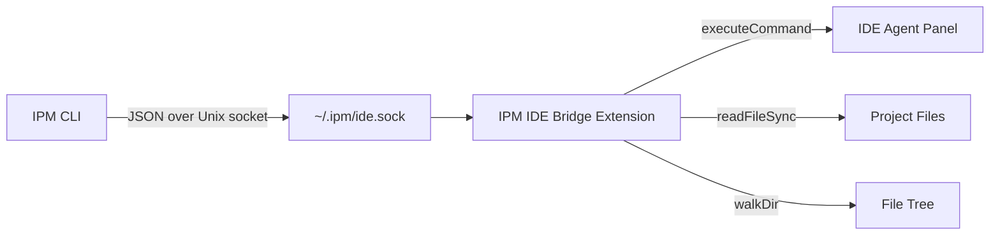
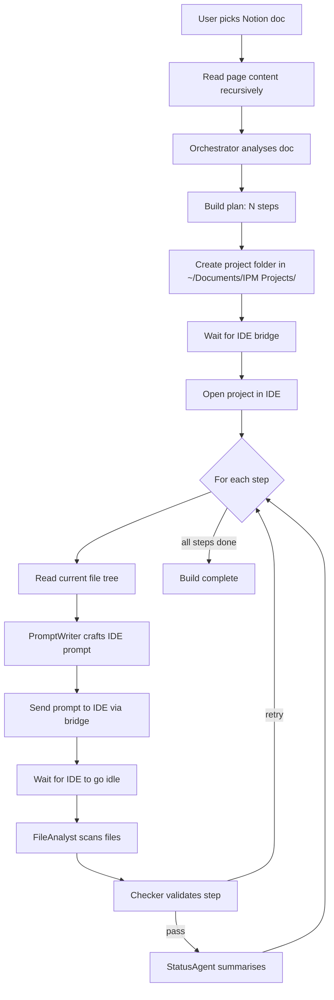

<p align="center">
  
</p>

> **Intelligent Project Manager** — An autonomous multi-agent IDE automation system powered by Groq.

IPM reads your project documentation from Notion, thinks about it using a team of specialized AI agents, and autonomously builds the project inside your IDE. You watch it happen in real time from a beautiful terminal UI.

---

## What is IPM?

IPM is not a chatbot. It is an **autonomous build agent** that:

1. Reads your Notion project documentation
2. Spins up a team of 5 specialized AI agents
3. Each agent has a specific role and the best model for that role
4. Agents communicate with each other in real time
5. IPM sends precise prompts to your IDE step by step
6. The IDE builds the project while IPM watches, validates, and corrects

You open IPM in your terminal, pick a Notion doc, and watch your project get built.

---

## Architecture

### Multi-Agent System



### Agent Roles & Models

| Agent | Model | Role |
|---|---|---|
| Orchestrator | `moonshotai/kimi-k2-instruct` | Reads docs, creates build plan, coordinates all agents |
| Prompt Writer | `moonshotai/kimi-k2-instruct` | Converts steps into precise IDE prompts |
| File Analyst | `moonshotai/kimi-k2-instruct-0905` | Reads file tree, assesses what was built |
| Checker | `groq/compound` | Validates each step, decides pass or retry |
| Status Agent | `llama-3.1-8b-instant` | Produces fast human-readable status lines for TUI |

> Models are fetched **live** from the Groq API on every run. The best available model is auto-assigned to each role — no hardcoded lists.

### Inter-Agent Communication

All agents share a **MessageBus**. Every message between agents is visible in the TUI in real time — you can watch `Orchestrator → PromptWriter`, `FileAnalyst → Checker`, `Checker → Orchestrator` as they happen.



### System Architecture



---

## IDE Bridge Extension

IPM controls your IDE through a **VS Code-compatible extension** (`ide-extension/`) that:

- Listens on a Unix socket at `~/.ipm/ide.sock`
- Receives JSON messages from IPM CLI
- Opens folders, sends prompts to the IDE agent panel, reads files, lists directories
- Writes a `~/.ipm/bridge.ready` file when active so IPM knows the IDE is connected

The extension is **auto-installed** on first run — IPM copies it to `~/.kiro/extensions/ipm.ide-bridge-1.0.0/` automatically. You just need to restart your IDE once.



---

## TUI — Terminal UI

IPM runs entirely in your terminal using **Ink** (React for CLIs).

### Screens

**Splash** — Animated lobster ASCII art on startup

**Token Setup** — First-run Notion token entry (stored in SQLite, never re-asked)

**Doc Picker** — Scrollable list of all your Notion pages

**Agent Communications Panel** — Live feed of every inter-agent message, color-coded by agent:

```
Orchestrator  →  ALL          *  Plan: 6 steps for "my-saas-app"
PromptWriter  →  IDE          >  Prompt ready (412 chars) for step 1
FileAnalyst   →  Checker      #  3 files found: index.js, package.json, README.md
Checker       →  Orchestrator v  Step passed: project structure created correctly
StatusAgent   →  TUI          .  Setting up project scaffold
```

Color legend:
- 🟠 **Orchestrator** — orange
- 🔵 **PromptWriter** — cyan
- 🔷 **FileAnalyst** — blue
- 🟡 **Checker** — yellow
- ⚫ **StatusAgent** — gray
- 🟢 **IDE** — green

---

## Installation

### Prerequisites

- Node.js 18+
- A [Groq API key](https://console.groq.com/) (free tier works)
- A [Notion Integration Token](https://www.notion.so/my-integrations)
- [Kiro IDE](https://kiro.dev/) or any VS Code-compatible IDE installed

### Install Globally

```bash
git clone https://github.com/Shubham-Ramkabir/IPM.git
cd IPM
npm install --legacy-peer-deps
npm install -g . --legacy-peer-deps --prefix ~/.npm-global
```

Add to your shell profile if not already:

```bash
export PATH="$HOME/.npm-global/bin:$PATH"
```

### Configure API Key

Create a `.env` file in the project root:

```bash
cp .env.example .env
# Edit .env and add your Groq API key
```

```env
GROQ_API_KEY=your_groq_api_key_here
```

---

## First Run

```bash
IPM
```

1. Splash screen plays
2. IPM asks for your Notion Integration Token (one time only)
3. Your Notion pages load in a scrollable list
4. Pick a project doc
5. IPM starts the multi-agent pipeline
6. Watch agents communicate in real time in the terminal
7. Your IDE builds the project in `~/Documents/IPM Projects/<project-name>/`

---

## Project Output

All projects are created at:

```
~/Documents/IPM Projects/
└── your-project-name/
    ├── src/
    ├── package.json
    ├── README.md
    └── ...
```

---

## File Structure

```
IPM/
├── bin/
│   └── ipm.js                  # CLI entry point
├── src/
│   ├── tui/
│   │   └── index.js            # Ink TUI — all screens and agent comms panel
│   ├── agent/
│   │   ├── agents.js           # 5 agents + MessageBus + live model fetching
│   │   ├── runner.js           # Build pipeline orchestration
│   │   ├── ide.js              # IDE bridge client + auto-install
│   │   └── notion.js           # Notion API client
│   └── db/
│       └── index.js            # SQLite config + run history
├── ide-extension/
│   ├── extension.js            # VS Code extension — Unix socket server
│   └── package.json
├── .env.example                # API key template
├── package.json
└── Readme.md
```

---

## How the Build Pipeline Works



---

## Data & Privacy

- Your Notion token is stored locally in `~/.ipm/ipm.db` (SQLite)
- Your Groq API key stays in `.env` — never committed to git
- Run history is stored locally in `~/.ipm/ipm.db`
- Nothing is sent anywhere except Groq API (for LLM calls) and Notion API (for doc reading)

---

## Tech Stack

| Layer | Technology |
|---|---|
| Terminal UI | [Ink](https://github.com/vadimdemedes/ink) (React for CLIs) |
| LLM Provider | [Groq](https://groq.com/) — ultra-fast inference |
| Models | Kimi K2, Groq Compound, Llama 3.1 |
| Notion | [@notionhq/client](https://github.com/makenotion/notion-sdk-js) |
| Database | [better-sqlite3](https://github.com/WiseLibs/better-sqlite3) |
| File Watching | [chokidar](https://github.com/paulmillr/chokidar) |
| IDE Bridge | VS Code Extension API (Unix socket) |
| ASCII Art | [figlet](https://github.com/patorjk/figlet.js) |

---

## Development

```bash
# Run directly without global install
node bin/ipm.js

# Smoke test (checks imports, shows splash)
node -e "import('./src/tui/index.js').catch(e => { process.stderr.write(e.stack); process.exit(1); }); setTimeout(() => process.exit(0), 1500);"
```

---

## License

MIT

---

## Built By

**Shubham Ramkabir** — AI-First Developer @ E2M

Powered by [Groq](https://groq.com/) · [Kiro](https://kiro.dev/) · [Notion](https://notion.so/)
